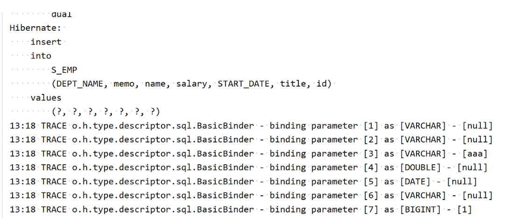

> 환경설정
> + 개발툴 : InteliJ
> + Spring Boot : 2.7.14
> + Hibernate : 5.6.15
> + Java : 11
> + Gradle


검색을 해보면 application.properties 파일에   
```
logging.level.org.hibernate.SQL = debug
logging.level.org.hibernate.type.descriptor.sql = trace
```
이 내용을 추가하면 파라미터 바인딩이 출력된다고 하는데, 저의 경우에는 그렇게 해도 나오지 않았습니다.   
이 글을 참고하여 하니 원하는 결과가 나왔습니다.   
👉🏻[hibernate 의 완성된(?) 쿼리를 확인 하는 방법 문의 드립니다](https://www.inflearn.com/community/questions/59014/hibernate-%EC%9D%98-%EC%99%84%EC%84%B1%EB%90%9C-%EC%BF%BC%EB%A6%AC%EB%A5%BC-%ED%99%95%EC%9D%B8-%ED%95%98%EB%8A%94-%EB%B0%A9%EB%B2%95-%EB%AC%B8%EC%9D%98-%EB%93%9C%EB%A6%BD%EB%8B%88%EB%8B%A4)


## 1. bulid.gradle 파일에 추가 
```
implementation 'org.bgee.log4jdbc-log4j2:log4jdbc-log4j2-jdbc4.1:1.16'
```

## 2. logback.xml 파일 추가
`resources` 폴더 밑에 `logback.xml` 파일을 만들어줍니다.
```xml
<?xml version="1.0" encoding="UTF-8"?>
<configuration>
    <appender name="STDOUT" class="ch.qos.logback.core.ConsoleAppender">
        <layout class="ch.qos.logback.classic.PatternLayout">
            <Pattern>%d{HH:mm} %-5level %logger{36} - %msg%n</Pattern>
        </layout>
    </appender>

    <logger name="org.hibernate.type" level="trace" />

    <root level="info">
        <appender-ref ref="STDOUT" />
    </root>
</configuration>
```

## 3. 실행 결과
파라미터가 같이 나오는 것을 확인 할 수 있습니다.

+ 참조
    + https://www.inflearn.com/questions/59014/hibernate-%EC%9D%98-%EC%99%84%EC%84%B1%EB%90%9C-%EC%BF%BC%EB%A6%AC%EB%A5%BC-%ED%99%95%EC%9D%B8-%ED%95%98%EB%8A%94-%EB%B0%A9%EB%B2%95-%EB%AC%B8%EC%9D%98-%EB%93%9C%EB%A6%BD%EB%8B%88%EB%8B%A4