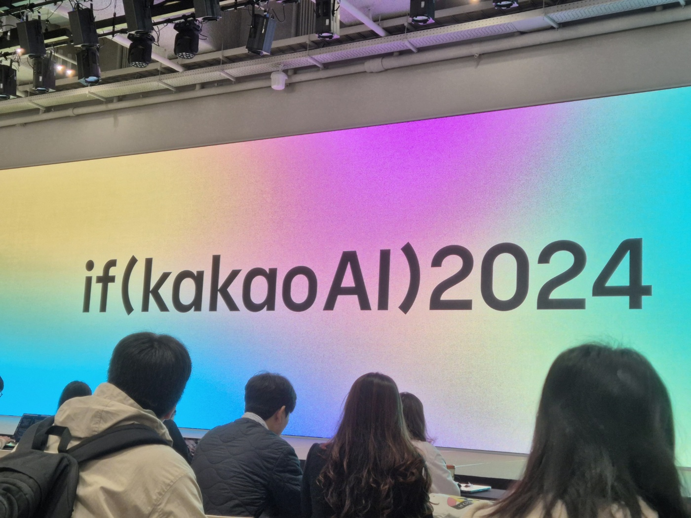
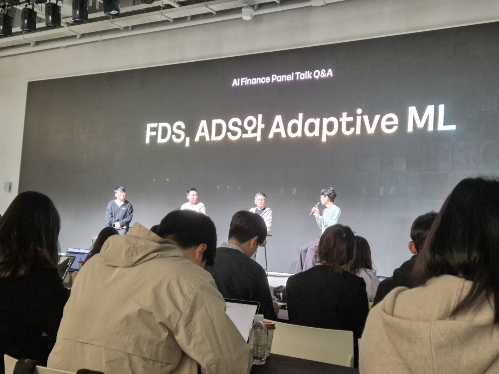
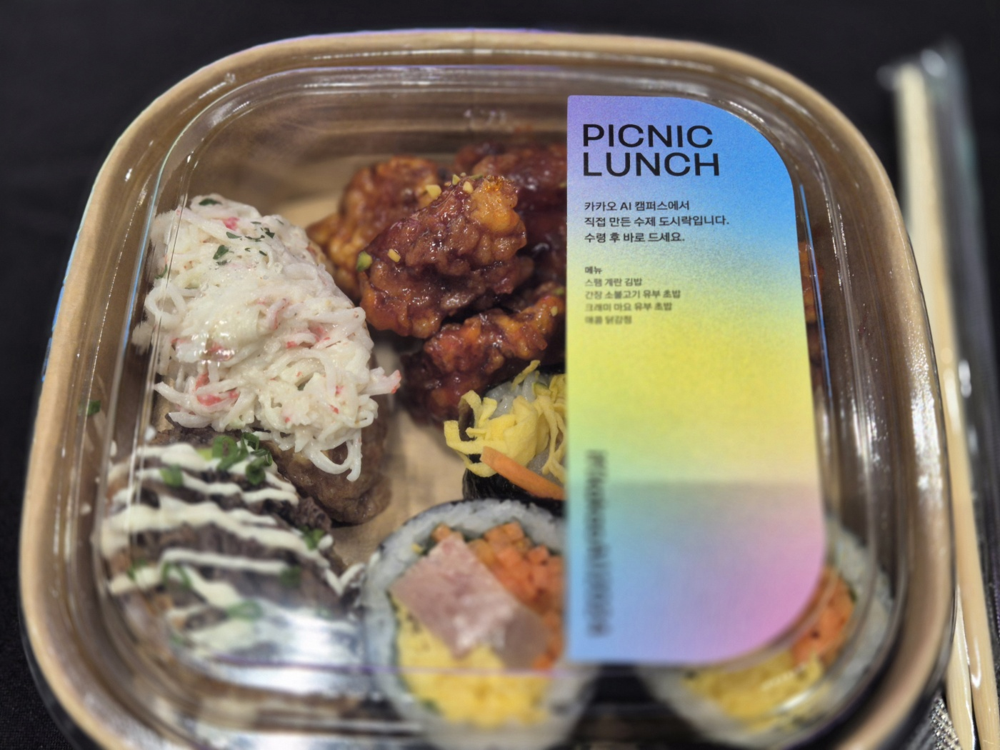
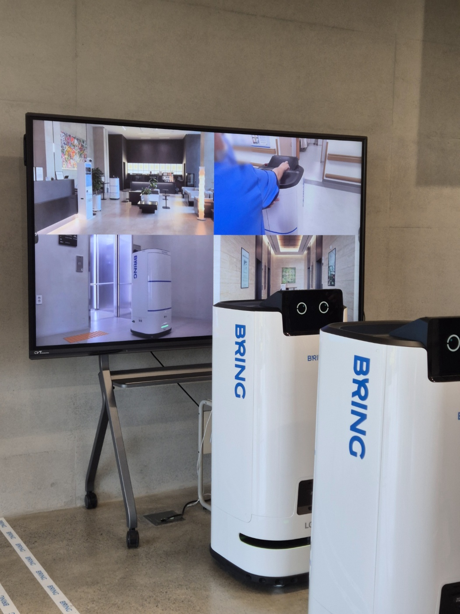

**if(kakao)** 는 카카오 그룹의 기술 비전을 공개하고 기술적 성과를 소개하는 대표 개발자 컨퍼런스입니다.   
매년 참여를 희망하며 신청했지만 올해 처음으로 당첨되는 행운을 얻어 마지막 날 행사에 참석할 수 있었습니다.

## 0. 셔틀버스 & 굿즈

오전 8시 20분까지 양재역에 도착해 셔틀버스를 타고 행사장으로 이동했습니다.   
버스에 타자마자 굿즈를 나눠주셔서 기분 좋게 시작할 수 있었습니다.

이번 행사는 경기도 용인에 위치한 카카오 AI 캠퍼스에서 진행되었는데요. 날씨도 좋고 캠퍼스 건물 역시 인상적이었습니다. 곳곳에 비치된 물, 음료, 견과류 등 간식 덕분에 행사 내내 편하게 즐길 수 있었던 점도 만족스러웠습니다.

## 1. Panel Talk

오전 10시 오프닝 세션이 시작되었습니다. 이 시간에는 카카오 계열사들이 AI 기술을 어떻게 활용하고 있는지 구체적으로 소개했는데요. **특히 카카오페이와 카카오뱅크가 이상 거래 탐지 시스템(FDS)에 AI를 적용하고 있다는 점이 인상 깊었습니다.**  기존에는 사람만이 판단할 수 있다고 여겨졌던 영역에 AI가 도입된 것을 보며 기술의 발전에 신기함을 느꼈습니다.

발표 내용은 금융 AI와 생활 AI 두 가지 주제로 나뉘었는데 개인적으로는 생활 AI 분야가 더 흥미로웠습니다. 특히 카카오페이지에서 AI가 웹툰 광고를 제작한다는 점이 놀라웠는데요. **사람이 작업하면 3주가 걸리는 일을 AI가 단 3시간 만에 처리할 수 있다고 합니다.**  또한 카카오모빌리티의 로봇 배송과 자율주행 택시에 대한 발표도 매우 흥미로웠습니다.

## 2. 점심시간 & 체험부스

카카오 AI 캠퍼스는 주변에 먹을만한 곳이 없습니다. 그래서 도시락 제공이 되었는데요. 아무래도 냉동이다보니 닭강정이랑 김밥이 좀 차갑더라구요. 식사 후에는 건물을 둘러보며 체험 부스도 구경했습니다. 밖에는 자율주행 택시가 1층 체험존에는 카바나 AI 포토부스가 있었고 2층에서는 카카오모빌리티의 로봇배송 서비스인 '브링'과 카카오헬스의 '파스타' 등 다양한 기술들을 직접 체험할 수 있었습니다. 오전에 들었던 기술 설명을 실제로 사용해 볼 수 있어 흥미로운 경험이었습니다.

## 3. 인상깊었던 세션

오전에는 카카오모빌리티 발표를 듣고 흥미가 생겨 **"무엇이든 로봇배송! 진짜 되는 플랫폼 이야기"** 세션에 참석했습니다. 기존 로봇 배송은 API 연동 방식으로 인해 여러 로봇 제조사에 공통 적용이 어려웠고 특정 제조사에 의존하는 구조였다고 합니다. 이를 개선하기 위해 설계를 변경하여 모든 제조사에 적용 가능한 플랫폼으로 바꿨다는 설명이 인상적이었습니다.

마지막으로 **"카카오 빌링 MySQL DB 샤딩 적용"** 세션도 들었는데요. 발표자분이 유머를 곁들여 진행해 즐겁게 들을 수 있었습니다. 😄 DB 샤딩(Sharding)은 데이터베이스 트래픽을 분산시키는 중요한 방법으로 쉽게 말해서 각 DB서버에 데이터를 나눠 저장하는 방식을 말합니다. 기존에는 1대 서버에 의존하던 것을 12대로 대폭 확장했다고 합니다. 이 작업은 카카오 DB 팀과 협업해 108일 동안 진행되었다고 하네요.

## 4. 마무리

이번 카카오 AI 캠퍼스 방문을 통해 다양한 기술을 직접 체험하고 최신 트렌드를 배울 수 있는 뜻깊은 시간이었습니다. 특히 로봇 배송과 DB 샤딩과 같은 실무적이고 혁신적인 주제들을 접하며 많은 인사이트를 얻을 수 있었는데요. 앞으로도 이런 기술들이 어떻게 발전해 나갈지 기대가 됩니다. 또 이런 경험을 바탕으로 제 업무와 성장에도 도움이 될 수 있을 것 같아 더욱 의미 있었던 시간이었습니다.

## 참조
+ https://if.kakao.com/session?t.RVmWsFVgRd=2