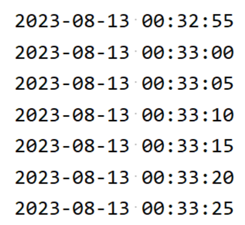

> 환경설정
> + 개발툴 : InteliJ
> + Spring Boot : 2.7.14
> + Quartz : 2.3.2
> + Java : 11
> + Gradle


Spring Boot에서 Quartz 연동 하는 예제를 소개합니다.

## 1. bulid.gradle 파일에 추가 
```
implementation "org.springframework.boot:spring-boot-starter-quartz"
```

## 2. @Scheduled 어노테이션을 이용
스케쥴러를 적용할 메소드에 `@Scheduled` 어노테이션을 사용합니다.
```java
@Controller
public class QuartzController {
    @Scheduled(cron = "0/5 * * * * ?")
    public void everyFiveSeconds() {
        DateTimeFormatter patten = DateTimeFormatter.ofPattern("yyyy-MM-dd HH:mm:ss");
        String formatDt = patten.format(LocalDateTime.now());

        System.out.println(formatDt);
    }
}
```
`@SpringBootApplication`이 붙은 파일에 `@EnableScheduling` 어노테이션를 추가합니다.   
추가 하지 않으면 스케쥴러가 실행되지 않습니다.
```java
@SpringBootApplication
@EnableScheduling
public class Application {
    public static void main(String[] args) {
        SpringApplication.run(Application.class, args);
    }
}
```
> @EnableScheduling
> + 스케쥴러를 기능을 켜는 역할을 하며, @Scheduled 어노테이션을 찾아서 실행을 시킨다.

## 3. 실행 결과
5초마다 실행 된것을 확인 할 수 있습니다.

+ 참조
    + https://docs.spring.io/spring-framework/docs/current/javadoc-api/org/springframework/scheduling/annotation/EnableScheduling.html